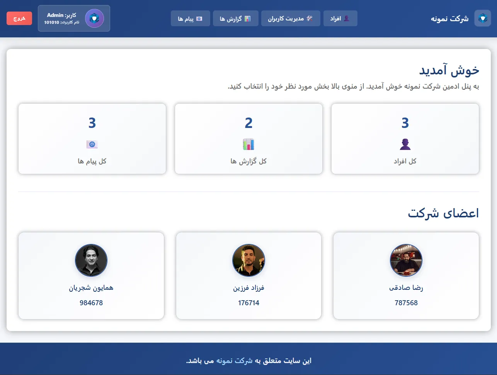
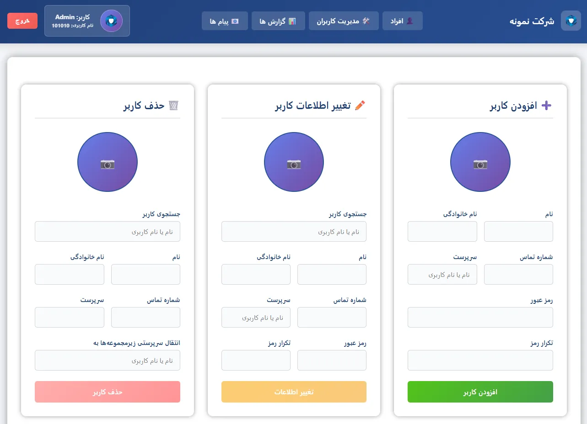
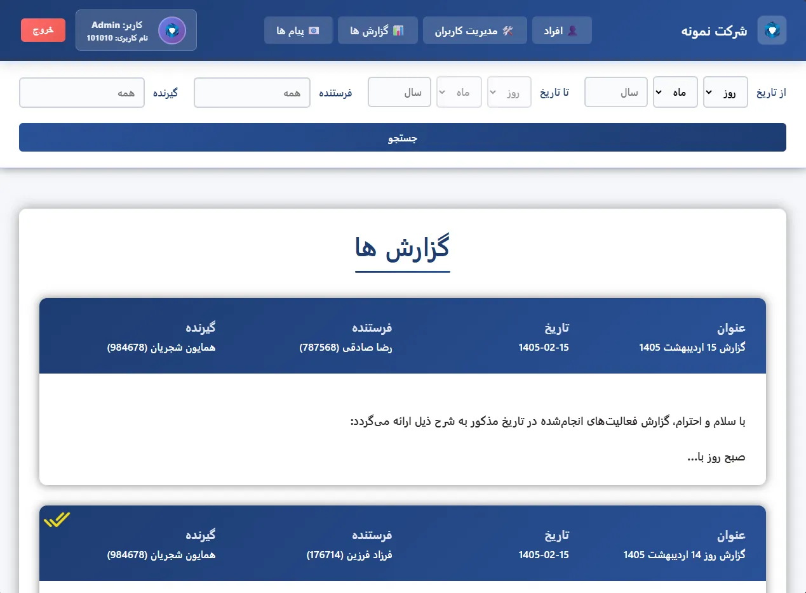
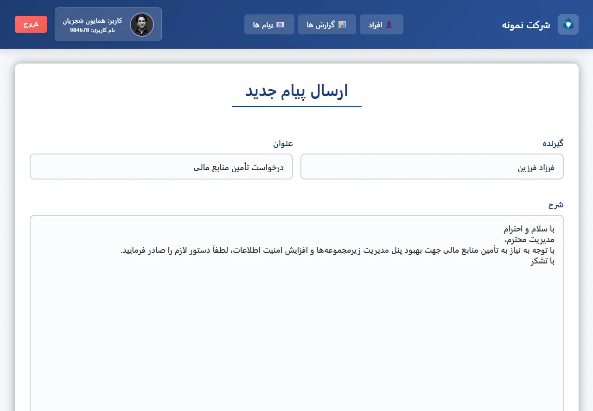
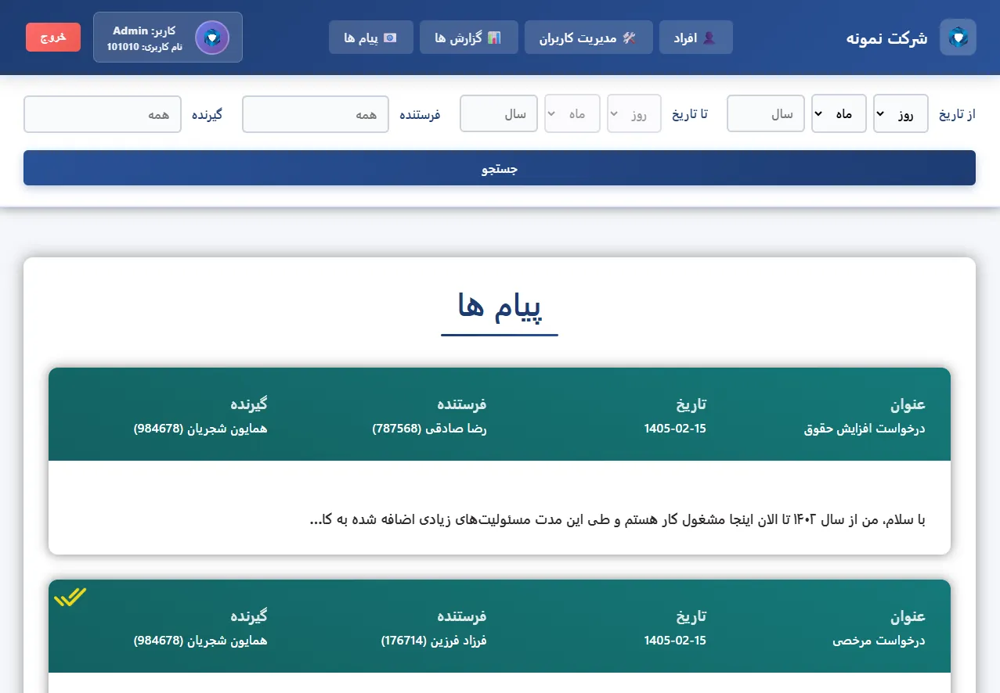

# 🎯 Company Platform — Organizational Management System
### Live Demo:  [https://company.omidamiri.com](https://company.omidamiri.com)
<h3>Company Platform — Structured management, without friction 🚀</h3>
A full-scale organizational platform built for teams that need structure — combining internal messaging, real-time reporting, sub-account management, and role-based access control in one secure workspace.

## 📸 Platform Preview
<h3 align="center">Sub-Accounts & Profiles</h3>

  

<h3 align="center">Manage Accounts</h3>

  

<h3 align="center">Create Message/Report & Message/Report Lists</h3>

  
  
  

## ✨ Key Features

### 🏢 Organization
- Full automation of sub-account and profile management
- Real-time monitoring of team activity
- Role-based access control for every user level
- Message and report review system
- Financial and operational reporting

### 👤 Manager
- Manage sub-accounts, roles, and permissions
- Send and receive internal messages
- Send and receive structured reports
- Track team performance over time

### 👥 Member
- Access assigned sub-accounts and profiles
- Direct messaging with managers and peers
- Submit reports and receive feedback
- Secure access to shared resources

## 🛠️ Tech Stack

| Layer | Technology |
|-------|------------|
| **Backend** | Django |
| **Frontend** | HTML, CSS, JavaScript |
| **Database** | MySQL |

## 🎯 Competitive Advantages

- **Full automation** of organizational workflows
- **Clean role-based access** for every user level
- **Real-time messaging** and reporting
- **Transparent communication** between all levels
- **Scalable structure** for teams of any size

**Company Platform** — Where teams stay in sync 🚀
